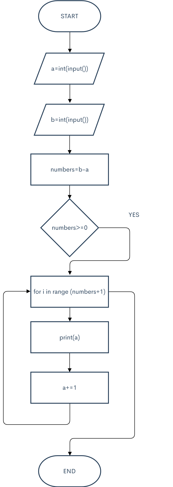

# 1.Series one



```.py
a=int(input())
b=int(input())
numbers=b-a
if numbers>=0:
    for i in range(numbers+1):
        print(a)
        a+=1
```

# 2.Series two

```.py
if a<b:
    for i in range(num+1):
        print(a)
        a+=1
else:
    for i in range(num+1):
        print(a)
        a-=1
```

# 3.Sum of ten number

```.py
y=0
for i in range (10):
    x=int(input())
    y+=x
    
print(y)
```

# 4.Sum of N numbers

```.py
N=int(input())
y=0
for i in range (N):
    x=int(input())
    y+=x
    
print(y)
```

# 5.Sum of cubes

```.py
N=int(input())
x=1
y=0
for i in range (N):
    y+=x**3
    x+=1
print(y)
```

# 6.Factorial

```.py
n=int(input())
x=1
for i in range (n):
   x*=(n)
   n-=1
print(x)
```

# 7.The number of zeros

```.py
N=int(input())
x=0
for i in range(N):
    if int(input())==0:
        x+=1
print(x)
```

# 8.Adding factorials

```.py
n=int(input())
x=3
y=3
z=2
if n==1:
    print(1)
elif n==2:
    print(3)
else:
    for i in range(n-2):
        y=y+z*x
        z*=x
        x+=1
    print(y)
```

# 9.Ladder

```.py
n=int(input())
x=[2,3,4,5,6,7,8,9]
y=1
z=1
if n==1:
    print(1)
else:
    print(1)
    for i in range(n-1):
        z=z*10+(y+1)
        y+=1
        print(z)
```

# 10.Lost card

```.py
N=int(input())
x=[N]
y=["a"]
for i in range(N-1):
    y.append(int(input()))
y.remove("a")
for i in range(N-1):
    N-=1
    x.append(N)
z=list(set(x)-set(y))
print(z[0])
```
