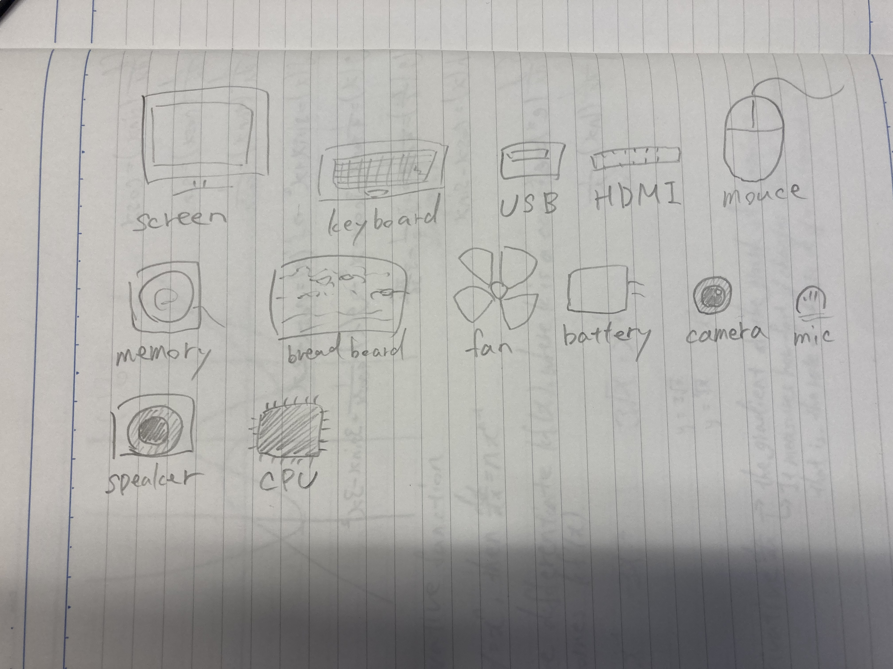

#Lesson1

##Drawing of a computer
This is my drawing of my computer as I know today web Aug 25 2021

I am showing a open box. A cardboard box.

  What variables in computer programming are:
    Variables are used to store information to be referenced and manipulated in a computer program.
  What types of variables we can use in Python:
    There is no restriction of types of variables in Python.
  What the four CTS(Computational Thinking Skills) are:
    ・Decomposition-breaking a difficult problem down into simple and easy-to-handle components
    ・Pattern Recognition-the skill of seeing similarities with problems
    ・Abstraction-is all about focusing on the details that matter whil ignoring the ones that don't.
    ・Algorithmic Thinking:generating a simple steps that anyone can follow to solve the problem
