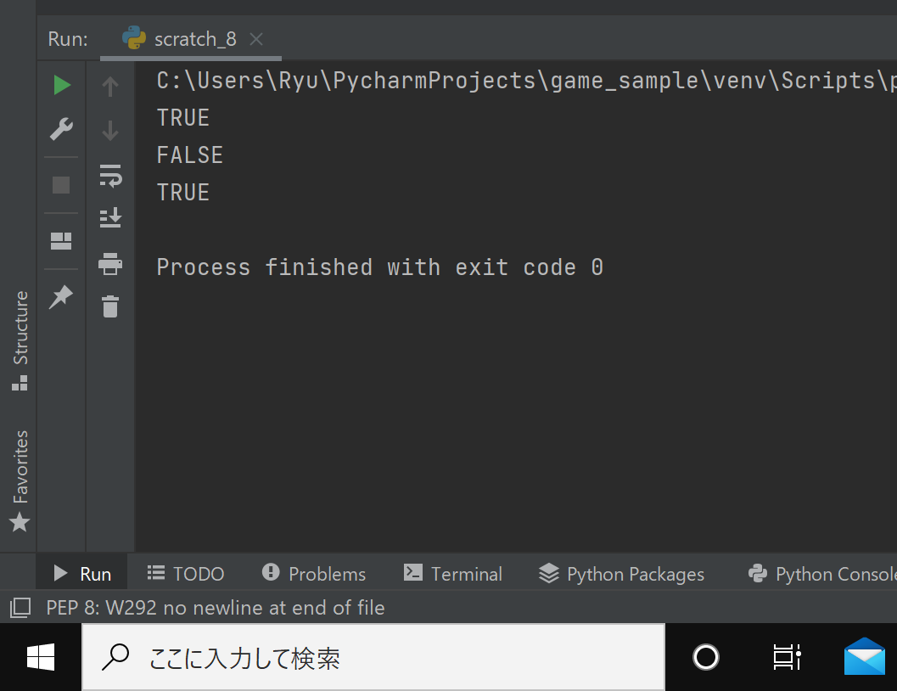

## Makes 20
### Given two numbers. If one of them is 20 or the sum of the two numbers is 20, it is TRUE. Otherwise, it is FALSE.

```.py
def Makes20(ip1,ip2):
    if ip1==20 or ip2==20:
        answer="TRUE"
    elif ip1+ip2==20:
        answer="TRUE"
    else:
        answer="FALSE"
    return answer
result=Makes20(1,19)
print(result)
result=Makes20(1,18)
print(result)
result=Makes20(1,20)
print(result)
```


