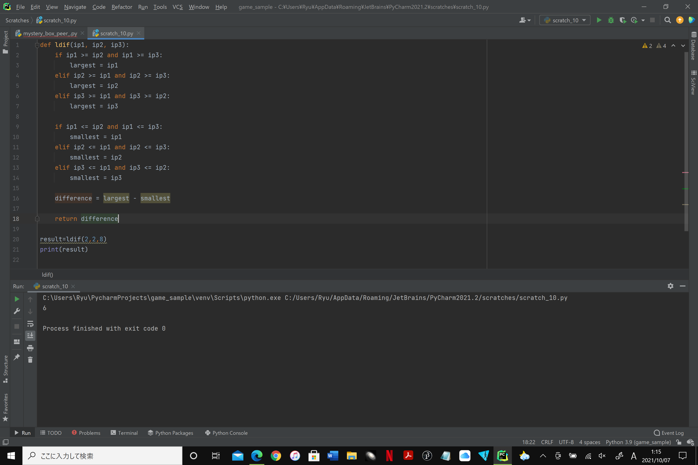

## The largest difference among three numbers
### Given three numbers. The largest difference between two of the three numbers.
```.py
def ldif(ip1,ip2,ip3):
  if ip1>=ip2 and ip1>=ip3:
    largest=ip1
  elif ip2>=ip1 and ip2>=ip3:
    largest=ip2
  elif ip3>=ip1 and ip3>=ip2:
    largest=ip3

  if ip1<=ip2 and ip1<=ip3:
    smallest=ip1
  elif ip2<=ip1 and ip2<=ip3:
    smallest=ip2
  elif ip3<=ip1 and ip3<=ip2:
    smallest=ip3
    
  difference=largest-smallest
  
  return difference
  ```
  
  
