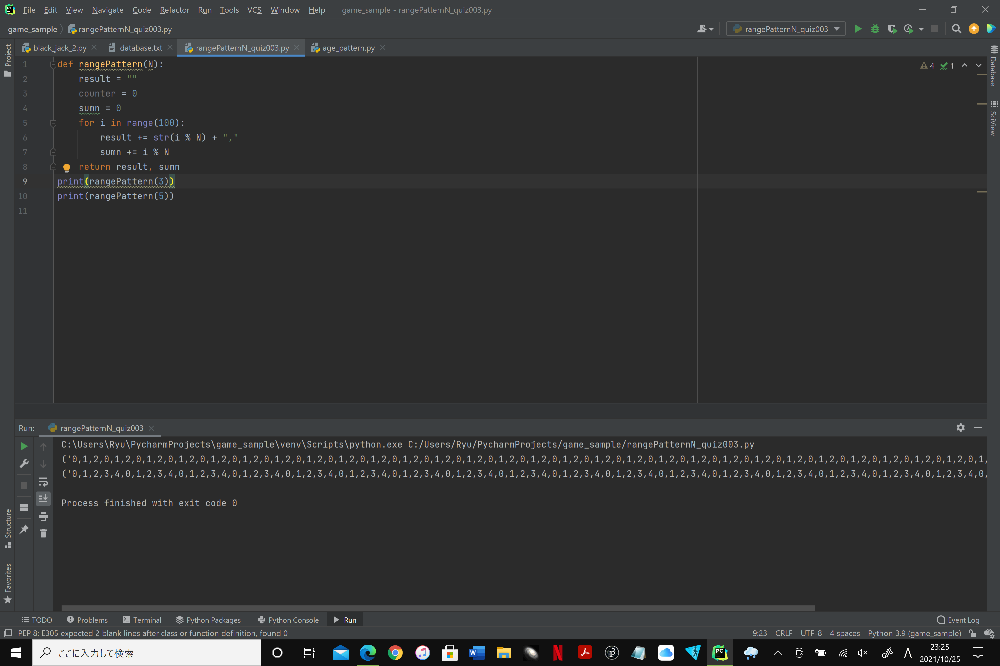

### Given an integer N, show 100 integers with the repeating pattern 0 to N-1, 0 to N-1,... plus addtion of the number

```.py
def rangePattern(N):
    result = ""
    counter = 0
    sumn = 0
    for i in range(100):
        result += str(i % N) + ","
        sumn += i % N
    return result, sumn
```


